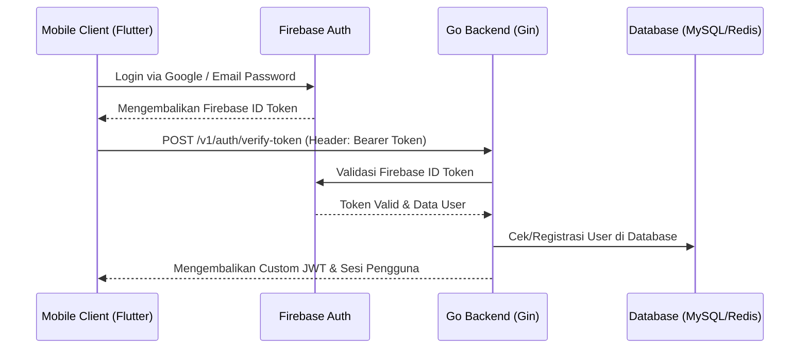

##  APlikasi Store Ac dan Uang Kilat

 * Nama : Dimas Prasetyo
 * NIM  : 1123150165
 * Kelas : TI SE 23 p2
 * Nama Dosen  : I ketut Gunawan, S.Kom, M.T.I
 * Matakuliah : Pemerograman Mobile Lanjutan

Aplikasi ini bertujuan untuk menuntaskan nilai UAS matakuliah Pemerograman Mobile Lanjutan Semester 6 di Global Institute

## Arsitektur Sistem (System Architecture)

Proyek ini terdiri dari dua sistem aplikasi utama yang masing-masing memiliki komponen **Frontend (Flutter)** dan **Backend (Golang)**:

### 1. Aplikasi Uang Kilat (E-Money / Dompet Digital Kampus)
Aplikasi finansial kampus untuk pembayaran, transfer, top-up, dan riwayat transaksi.
*   **Frontend**: Dibangun menggunakan **Flutter** dengan pendekatan **Clean Architecture** (Data, Domain, Presentation) dan **BLoC Pattern** untuk state management. Navigasi menggunakan **GoRouter**, request HTTP menggunakan **Dio**, dan penanganan dependencies dengan **GetIt**.
*   **Backend (`Be-Uang-Kilat`)**: Dibangun menggunakan **Golang** dengan **Gin Gonic Framework**. Menggunakan **MySQL (GORM)** untuk database utama, **Redis** untuk manajemen sesi/OTP, dan **Firebase Admin SDK** untuk validasi otentikasi. Dilengkapi dengan sistem keamanan **2FA (TOTP)** menggunakan Google Authenticator.

### 2. Aplikasi Store AC (E-Catalog Pendingin Udara)
Aplikasi katalog penjualan AC, pengelolaan keranjang belanja, serta checkout barang.
*   **Frontend (`store_ac`)**: Dibangun menggunakan **Flutter** dengan pendekatan **Feature-Based Architecture** dan **Provider Pattern** sebagai state management.
*   **Backend (`Be-Catalog-ku`)**: Dibangun menggunakan **Golang** dengan **Gin Gonic Framework**, **GORM** untuk koneksi database, dan integrasi **Firebase Auth** untuk otentikasi pengguna dan pemisahan role (User & Admin).

---

## Alur Kerja Aplikasi (Application Flow)

### 1. Alur Otentikasi & Keamanan (Authentication & Auth Flow)

*   **Uang Kilat 2FA/TOTP Flow**: Setelah login utama berhasil, pengguna dapat mengaktifkan 2FA. Request `POST /totp/register` akan men-generate kunci rahasia TOTP. Setiap transaksi sensitif (seperti transfer) akan meminta kode verifikasi OTP via email/Firebase atau 6-digit TOTP dari Google Authenticator yang divalidasi langsung oleh backend menggunakan bantuan Redis.

### 2. Alur Transaksi & Pembayaran (Payment & Checkout Flow)
*   **Uang Kilat (Transfer & Topup)**: 
    1. Pengguna memasukkan nominal transfer dan tujuan (atau scan QR Merchant).
    2. Aplikasi mengirimkan request transfer ke backend.
    3. Backend memverifikasi otentikasi biometrik/PIN/OTP.
    4. Database mengurangi saldo pengirim dan menambah saldo penerima dalam satu transaksi database atomik (ACID) menggunakan GORM, lalu mencatatnya ke tabel riwayat transaksi.
*   **Store AC (Keranjang & Checkout)**:
    1. Pengguna menambahkan AC pilihan ke keranjang belanja (lokal/API `/cart`).
    2. Melakukan checkout produk melalui endpoint `/transactions/checkout`.
    3. Backend memproses pembuatan pesanan dan memicu callback integrasi status pembayaran.

---

## Struktur Folder Lengkap (Full Folder Structure)

### 1. Frontend: Uang Kilat (`Uang-kilat/`)
Struktur folder menggunakan **Clean Architecture** (Data, Domain, Presentation):
```text
Uang-kilat/
├── android/
├── ios/
├── assets/
│   └── icons/
├── lib/
│   ├── core/                  # Utilitas, konfigurasi global, tema, router
│   │   ├── constants/         # Konstanta warna, assets, endpoint API
│   │   ├── error/             # Exception & Failure handling
│   │   ├── network/           # Client network (Dio custom interceptors)
│   │   ├── router/            # GoRouter navigation paths
│   │   ├── services/          # Local storage (Secure storage, SharedPreferences)
│   │   └── theme/             # Styling & tipografi aplikasi
│   ├── data/                  # Implementasi API request & database lokal
│   │   ├── datasources/       # Data source (Remote & Local)
│   │   ├── models/            # JSON serialization models
│   │   └── repositories/      # Implementasi interface repository dari domain
│   ├── domain/                # Logika bisnis inti murni (tanpa dependencies UI)
│   │   ├── entities/          # Objek data dasar aplikasi
│   │   ├── repositories/      # Definisi kontrak / interface repository
│   │   └── usecases/          # Fungsi spesifik bisnis (e.g. DoTransfer, GetProfile)
│   ├── presentation/          # Bagian antarmuka pengguna (UI)
│   │   ├── blocs/             # Flutter BLoC (State, Event, Bloc)
│   │   ├── pages/             # Halaman-halaman aplikasi (Home, Auth, QR Scanner, dll)
│   │   └── widgets/           # Widget reusable (Button, TextField, Card)
│   ├── injection/             # Dependency Injection Container (GetIt)
│   ├── firebase_options.dart  # Konfigurasi Firebase untuk Android/iOS
│   └── main.dart              # Entrypoint aplikasi
├── pubspec.yaml               # Metadata proyek & dependencies Flutter
└── README.md
```

### 2. Backend: Uang Kilat (`Be-Uang-Kilat/`)
Struktur folder modular berorientasi service di Golang:
```text
Be-Uang-Kilat/
├── config/                    # Konfigurasi aplikasi & parsing environment variables
├── database/                  # Inisialisasi MySQL (GORM), Redis, dan Firebase App
├── handlers/                  # Controller layer (HTTP Request & Response parsing)
├── middleware/                # Logger, CORS, & JWT Authentication Middleware
├── models/                    # Definisi struct database schema & request/response DTOs
├── routes/                    # Definisi router group & endpoint API Gin
├── services/                  # Business logic (JWT token gen, Email sender, OTP engine)
├── postman/                   # Koleksi API Postman untuk testing endpoint
├── firebase-service-account.json # Kredensial Firebase SDK backend
├── main.go                    # Entrypoint server Golang
├── go.mod                     # Golang modules dependencies
└── .env                       # Konfigurasi database & API Key lokal
```

### 3. Frontend: Store AC (`store_ac/`)
Struktur folder menggunakan **Feature-Based Architecture**:
```text
store_ac/
├── assets/
│   └── icons/
├── lib/
│   ├── core/                  # Base configuration & global shared code
│   │   ├── constants/         # API Endpoint & app constants
│   │   ├── guards/            # Route guarding (Auth / Guest verification)
│   │   ├── routes/            # Rute navigasi halaman
│   │   ├── services/          # HTTP Client, Secure Storage, Notifications
│   │   ├── shared/            # Shared components (reusable widgets)
│   │   └── theme/             # Tema visual aplikasi
│   ├── features/              # Pembagian folder berdasarkan fitur bisnis
│   │   ├── auth/              # Halaman, controller (Provider), model login/register
│   │   ├── cart/              # Keranjang belanja & logika checkout
│   │   └── dashboard/         # Halaman katalog produk AC, admin panel
│   ├── firebase_options.dart
│   └── main.dart              # Bootstrapping Provider & Firebase
└── pubspec.yaml
```

### 4. Backend: Store AC (`Be-Catalog-ku/`)
Struktur layer logic dan database repository di Golang:
```text
Be-Catalog-ku/
├── config/                    # Inisialisasi Firebase & database SQL GORM
├── handlers/                  # Logika controller penangan rute HTTP
├── middleware/                # Auth verification & Admin authorization guard
├── models/                    # Skema database & entitas (Product, Cart, User, Transaksi)
├── repositories/              # Layer akses database langsung (Data access layer)
├── routes/                    # Konfigurasi Gin Router & CORS handler
├── seeds/                     # Data dummy/seeding awal (e.g. data AC standar)
├── services/                  # Logika pemrosesan bisnis dan transaksi checkout
├── firebase-service-account.json
├── main.go                    # Entrypoint aplikasi server
├── go.mod
└── .env
```

## Link Repositories & Presentasi Youtube

### Github Repository

* [Store Ku](https://github.com/GAJAHGAJAH/store-ac.git) - Klik untuk melihat repositori Store Ac

* [Uang Kilat](https://github.com/GAJAHGAJAH/Uang-kilat.git) - Klik untuk melihat repositori Uang KILAT

* [Backend Store Ku](https://github.com/GAJAHGAJAH/be-store-ac-ku.git) - Klik untuk melihat repositori Backend Api Store Ac

* [Backend Uang Kilat](https://github.com/GAJAHGAJAH/be-uang-kilat.git) - Klik untuk melihat repositori Backend Api Store ku

### Presentasi Youtube

* [Link Presentasi Youtube](https://youtu.be/5e0E1nHW-K0?si=14PDjSzZVp0Y_HzE) - Klik untuk melihat presentasi Youtube